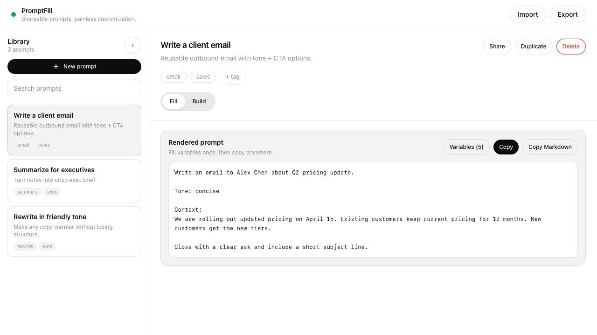
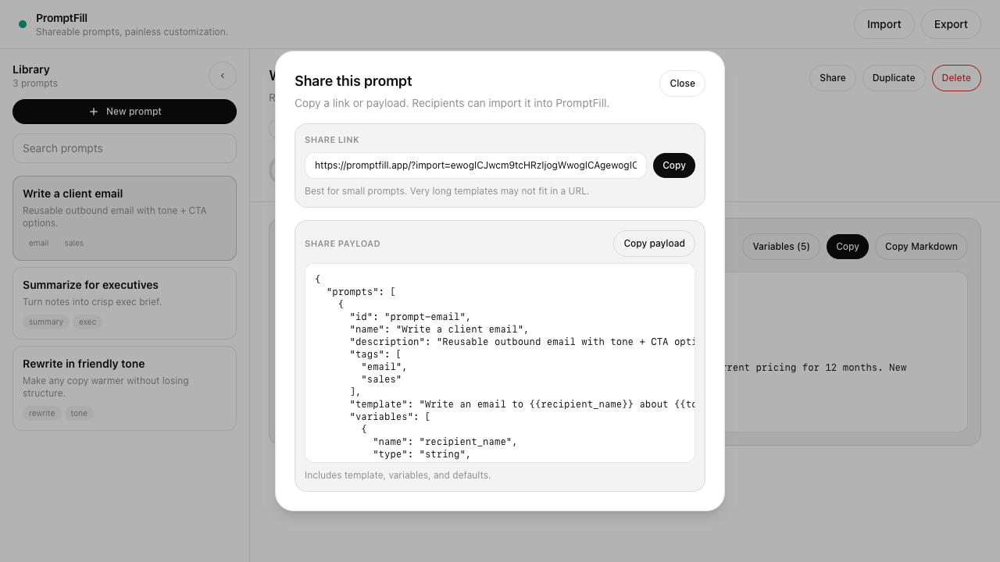

# PromptFill

Local-first prompt library + editor for LLM prompts with typed variables and dropdown selectors.

## Repo layout
- `web/` — Next.js web MVP (library + builder + share/import/export)
- `video/` — Remotion marketing/explainer video
- `docs/` — PRD + use cases + user stories + AI extraction spec

## Dev
```bash
cd web && npm install
cd ../video && npm install

# Web app (runs on http://localhost:3100)
cd ..
npm run dev:web

# Remotion Studio (runs on http://localhost:3000)
npm run dev:video
```

## Video assets
The explainer video uses real screenshots from the web app plus highlight boxes.

```bash
cd video
npm run capture:ui
```

## Tests
```bash
cd web
npm test
```

## Remotion skills + demo gallery

This project now includes a brand-first Remotion workflow and is designed to pair with:

- [$remotion-motion-director](/Users/danielgreen/.codex/skills/remotion-motion-director/SKILL.md) for storyboard quality, cinematic pacing, and iterative critique loops.
- [$remotion-best-practices](/Users/danielgreen/.codex/skills/remotion-best-practices/SKILL.md) for technical correctness (timing, transitions, GIF handling, composition patterns, captions, and rendering).

### Demo previews

These previews use clean product captures (no annotation overlays) sourced from `video/public/ui/`.

#### Library and prompt view



#### Variable drawer flow


#### Share modal flow



### Optional GIF exports

If you want animated README-ready assets, export GIFs to `docs/gifs/`:

```bash
mkdir -p docs/gifs
ffmpeg -y -loop 1 -t 4 -i video/public/ui/promptfill-ui-1280x720.png -vf "fps=10,scale=960:-1:flags=lanczos" docs/gifs/promptfill-ui.gif
ffmpeg -y -loop 1 -t 4 -i video/public/ui/promptfill-drawer-1280x720.png -vf "fps=10,scale=960:-1:flags=lanczos" docs/gifs/promptfill-drawer.gif
ffmpeg -y -loop 1 -t 4 -i video/public/ui/promptfill-share-1280x720.png -vf "fps=10,scale=960:-1:flags=lanczos" docs/gifs/promptfill-share.gif
```

- [UI GIF](docs/gifs/promptfill-ui.gif)
- [Drawer GIF](docs/gifs/promptfill-drawer.gif)
- [Share GIF](docs/gifs/promptfill-share.gif)

## Brand builder (v1)

The repo now includes a portable, ready-to-render brand kit scaffold for Remotion:

- `video/src/brand-kits/stripe/` (tokens, provider, components, motion presets, templates, rules)
- `video/public/brand/stripe/logo.svg`
- `docs/plans/2026-02-06-remotion-skill-brand-builder-v1-prd.md`

Current defaults:

- Format strategy: **both**, optimized first for **Reels 9:16**
- Validation: **TypeScript + zod** script schema

### Scan a brand

```bash
npm run brand:scan -- --url https://stripe.com --brand-slug stripe
```

This writes style signal output to:

- `video/brand/<brand-slug>/brand-signals.json`

### Render brand kit scenes

In Remotion Studio, use these compositions:

- `StripeDemoReel9x16`
- `StripeDemoReel16x9`
- `StripeHookScene`
- `StripeProblemSolution`
- `StripeFeatureList`
- `StripeCTAEndCard`

Quick renders:

```bash
cd video
npm run render:stripe:reels
npm run render:stripe:yt
```
