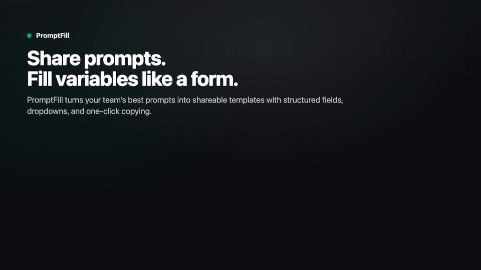
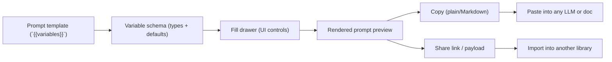

# PromptFill

<p align="center">
  
</p>

<p align="center">
  <em>Frames from our Remotion explainer (<code>video/src/PromptFillDemo.tsx</code>).</em>
</p>

<p align="center">
  <strong>Local-first prompt library</strong> where a prompt becomes a <strong>fillable form</strong>.
  <br />
  Typed variables · dropdown selectors · share/import/export · one-click copy
</p>

<p align="center">
  <a href="#why">Why</a>
  · <a href="#what-you-can-do-today-mvp">What you can do today</a>
  · <a href="#how-it-works">How it works</a>
  · <a href="#a-prompt-becomes-a-form">Example</a>
  · <a href="#screenshots">Screenshots</a>
  · <a href="#quickstart">Quickstart</a>
  · <a href="#prompt-spec-wip">Prompt spec</a>
  · <a href="#repo-layout">Repo layout</a>
</p>

---

## Why

Teams tend to store prompts as raw text in docs/snippets/DMs. Over time:

- prompts drift across copies
- variable fields get missed
- “choice axes” like tone/audience/format live in people’s heads

PromptFill makes prompts structured and reusable: **template + variables + sensible UI controls**.

> PromptFill generates prompts — it doesn’t run them against an LLM.

## What you can do today (MVP)

- Build a local prompt library (search, tags, duplicates).
- Turn prompts into templates with `{{variables}}` and typed fields.
- Start from built-in use-case starter templates (email, rewrite, support, review, summaries).
- Fill variables in a drawer (string/text/number/boolean/enum).
- Copy the rendered prompt (plain text or Markdown).
- Use a keyboard shortcut (`Cmd/Ctrl + Enter`) to copy instantly.
- Share a prompt as a link or payload; recipients can import it.
- Export/import your library as a JSON file (merge-on-conflict).
- Run a built-in onboarding tutorial with checklist progress and contextual guidance.
- Use the AI-assist extraction adapter (safe proposal modal) to improve variable suggestions without silent schema loss.

## How it works



## A prompt becomes a form

PromptFill treats your prompt like a template + schema.

**Template**

```txt
Write an email to {{recipient_name}} about {{topic}}.

Tone: {{tone}}

Context:
{{context}}

Close with a clear ask and include a short subject line.
```

**Variables (rendered as UI controls)**

| Variable | Type | Example |
| --- | --- | --- |
| `recipient_name` | `string` | `Alex Chen` |
| `topic` | `string` | `Q2 pricing update` |
| `tone` | `enum` | `concise` / `friendly` / `direct` / `formal` |
| `context` | `text` | meeting notes, email thread, etc. |

## Great for

- Reusable email / outreach prompts
- Exec summaries (tone + audience + format)
- Rewrite prompts with constraints
- Customer support reply templates
- PRDs, briefs, and structured writing

See more in `docs/USE_CASES.md`.

## Screenshots

<table>
  <tr>
    <td width="50%">
      
    </td>
    <td width="50%">
      
    </td>
  </tr>
  <tr>
    <td><strong>Fill</strong>: choose a prompt, preview live, copy anywhere.</td>
    <td><strong>Variables</strong>: dropdowns, text areas, booleans, defaults.</td>
  </tr>
  <tr>
    <td width="50%">
      
    </td>
    <td width="50%">
      
    </td>
  </tr>
  <tr>
    <td><strong>Share</strong>: copy a link or payload for import.</td>
    <td><strong>Inline</strong>: lightweight “app card” UX for quick reuse.</td>
  </tr>
</table>

## Quickstart

### Install

```bash
cd web && npm install
cd ../video && npm install
cd ..
```

### Run the web app

```bash
# http://localhost:3100
npm run dev:web
```

### Run Remotion Studio

```bash
# http://localhost:3000
npm run dev:video
```

### Tests & lint

```bash
npm run test:web
npm run lint:web
npm run lint:video
```

## Prompt spec (WIP)

There’s an evolving YAML prompt spec parser in `web/src/lib/promptSpec.ts`.

Example:

```yaml
id: summarize
name: Summarize for audience
templates:
  - id: default
    type: md
    path: template.md
variables:
  tone:
    type: enum
    selector:
      source: static
      options:
        - id: concise
          label: Concise
        - id: friendly
          label: Friendly
```

## Repo layout

- `web/` — Next.js web MVP (library + builder + share/import/export)
- `video/` — Remotion marketing/explainer scenes (uses real UI screenshots + highlight boxes)
- `docs/` — PRD + use cases + user stories + AI extraction spec

## Video asset pipeline

The explainer is built around real UI captures so the visuals stay honest.

```bash
cd video
npm run capture:ui
```

<details>
  <summary>Regenerate the README demo GIF</summary>

The README uses a tiny GIF slideshow assembled from Remotion still frames.

```bash
mkdir -p video/out
cd video
npx remotion still src/index.ts PromptFillDemo out/PromptFillDemo-f30.png --frame=30 --quiet
npx remotion still src/index.ts PromptFillDemo out/PromptFillDemo-f160.png --frame=160 --quiet
npx remotion still src/index.ts PromptFillDemo out/PromptFillDemo-f450.png --frame=450 --quiet
npx remotion still src/index.ts PromptFillDemo out/PromptFillDemo-f740.png --frame=740 --quiet
cd ..

mkdir -p docs/media
ffmpeg -y \
  -loop 1 -t 1.3 -i video/out/PromptFillDemo-f30.png \
  -loop 1 -t 1.3 -i video/out/PromptFillDemo-f160.png \
  -loop 1 -t 1.3 -i video/out/PromptFillDemo-f450.png \
  -loop 1 -t 1.3 -i video/out/PromptFillDemo-f740.png \
  -filter_complex "[0:v][1:v][2:v][3:v]concat=n=4:v=1:a=0,fps=12,scale=960:-1:flags=lanczos,split[s0][s1];[s0]palettegen=max_colors=256:stats_mode=diff[p];[s1][p]paletteuse=dither=sierra2_4a" \
  docs/media/promptfill-demo.gif
```
</details>

## Docs

- `docs/PRD.md` — product requirements
- `docs/USE_CASES.md` — prompt patterns where structure wins
- `docs/USER_STORIES.md` — MVP stories
- `docs/AI_EXTRACTION_SPEC.md` — AI-assisted variable extraction spec
