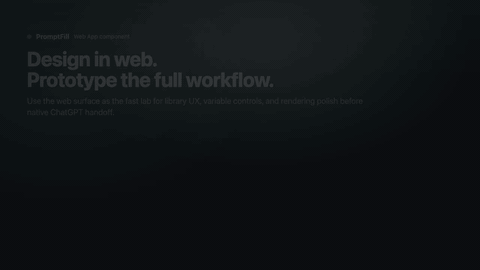
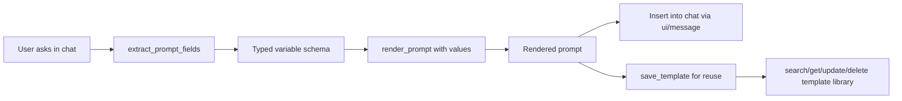
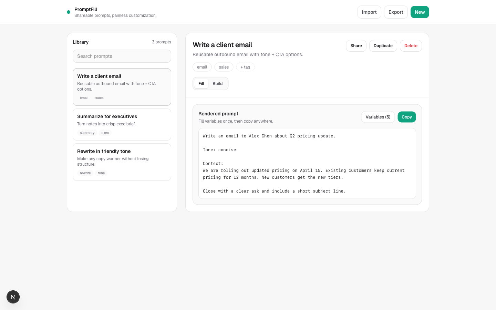
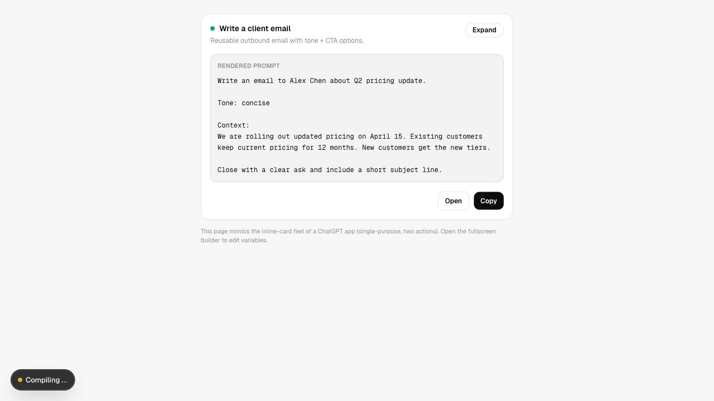

# PromptFill

<p align="center">
  <strong>One project. Two complementary components.</strong>
</p>

<p align="center">
  
  
</p>

<p align="center">
  <strong>Web App component:</strong> design and prototyping lab for prompt-library UX.
  <br />
  <strong>ChatGPT Apps SDK component:</strong> native in-chat product loop (extract → fill → render → insert).
</p>

<p align="center">
  <strong>ChatGPT-native prompt templating app</strong> where a prompt becomes a <strong>fillable form</strong>.
  <br />
  Extract fields · render reliably · insert back into chat · save for reuse
</p>

<p align="center">
  <a href="#why">Why</a>
  · <a href="#project-components">Project components</a>
  · <a href="#what-you-can-do-today-mvp">What you can do today</a>
  · <a href="#how-it-works">How it works</a>
  · <a href="#a-prompt-becomes-a-form">Example</a>
  · <a href="#screenshots">Screenshots</a>
  · <a href="#quickstart">Quickstart</a>
  · <a href="#prompt-spec-wip">Prompt spec</a>
  · <a href="#repo-layout">Repo layout</a>
</p>

---

## Why

Teams tend to store prompts as raw text in docs/snippets/DMs. Over time:

- prompts drift across copies
- variable fields get missed
- “choice axes” like tone/audience/format live in people’s heads

PromptFill makes prompts structured and reusable in conversation: **template + variables + fill + render + insert**.

> PromptFill generates prompts — it doesn’t run them against an LLM.

## Project components

PromptFill is one project with two complementary components:

- `Web App component` (`web/`): design/prototyping lab for high-velocity workflow iteration.
- `ChatGPT Apps SDK component` (`chatgpt-app/`): native product surface optimized for in-chat completion.

## What you can do today (MVP)

- In `chatgpt-app/`:
  - extract fields from rough prompt text (`extract_prompt_fields`)
  - fill values and render deterministic prompt output (`render_prompt`)
  - insert rendered prompt back into conversation (`ui/message`)
  - save, list, search, open, update, and delete templates in-session (`save_template`, `list_templates`, `search_templates`, `get_template`, `update_template`, `delete_template`)
  - start quickly from curated suggestions (`suggest_templates`)
- In `web/` (prototype lab):
  - iterate on richer prompt-library UX
  - test builder/fill flows before native Apps SDK rollout

## Release Candidate Notes (2026-02-06)

- Shipped conversation-first inline flow for extract -> fill -> render -> insert.
- Verified tool metadata contracts, widget contracts, spec cases, web tests, and lint gates.
- PR-ready release note: `docs/RELEASE_NOTES_2026-02-06.md`

## How it works



## A prompt becomes a form

PromptFill treats your prompt like a template + schema.

**Template**

```txt
Write an email to {{recipient_name}} about {{topic}}.

Tone: {{tone}}

Context:
{{context}}

Close with a clear ask and include a short subject line.
```

**Variables (rendered as UI controls)**

| Variable | Type | Example |
| --- | --- | --- |
| `recipient_name` | `string` | `Alex Chen` |
| `topic` | `string` | `Q2 pricing update` |
| `tone` | `enum` | `concise` / `friendly` / `direct` / `formal` |
| `context` | `text` | meeting notes, email thread, etc. |

## Great for

- Reusable email / outreach prompts
- Exec summaries (tone + audience + format)
- Rewrite prompts with constraints
- Customer support reply templates
- PRDs, briefs, and structured writing

See more in `docs/USE_CASES.md`.

## Screenshots

<table>
  <tr>
    <td width="50%">
      
    </td>
    <td width="50%">
      
    </td>
  </tr>
  <tr>
    <td><strong>Fill</strong>: choose a prompt, preview live, copy anywhere.</td>
    <td><strong>Variables</strong>: dropdowns, text areas, booleans, defaults.</td>
  </tr>
  <tr>
    <td width="50%">
      
    </td>
    <td width="50%">
      
    </td>
  </tr>
  <tr>
    <td><strong>Share</strong>: copy a link or payload for import.</td>
    <td><strong>Inline</strong>: lightweight “app card” UX for quick reuse.</td>
  </tr>
</table>

## Quickstart

### Install

```bash
cd chatgpt-app && npm install
cd ..
cd web && npm install
cd ../video && npm install
cd ..
```

### Run the web app

```bash
# http://localhost:3100
npm run dev:web
```

### Run Remotion Studio

```bash
# http://localhost:3000
npm run dev:video
```

### Tests & lint

```bash
npm run test:chatgpt-app
npm run test:web
npm run lint:web
npm run lint:video
```

## Prompt spec (WIP)

There’s an evolving YAML prompt spec parser in `web/src/lib/promptSpec.ts`.

Example:

```yaml
id: summarize
name: Summarize for audience
templates:
  - id: default
    type: md
    path: template.md
variables:
  tone:
    type: enum
    selector:
      source: static
      options:
        - id: concise
          label: Concise
        - id: friendly
          label: Friendly
```

## Repo layout

- `chatgpt-app/` — Apps SDK product surface (MCP server + inline widget)
- `web/` — Next.js design/prototyping lab
- `video/` — Remotion marketing/explainer scenes (uses real UI screenshots + highlight boxes)
- `docs/` — JTBD + PRD + use cases + user stories + spec/test docs

## Video asset pipeline

The explainer is built around real UI captures so the visuals stay honest.
Full MP4 artifacts in `renders/` are tracked with Git LFS, while README GIF embeds stay lower resolution.

```bash
cd video
npm run capture:ui
```

End-user series compositions (email, summary, support, PRD) live in:

- `video/src/PromptFillUserStorySeries.tsx`

<details>
  <summary>Regenerate ultimate demos and low-res README embeds</summary>

Heavy demo videos are kept in `renders/` (Git LFS). README embeds are lower-resolution GIFs in `docs/media/`.

```bash
cd video
npx remotion render src/index.ts PromptFillDemo ../renders/promptfill-ultimate-web.mp4
npx remotion render src/index.ts PromptFillFlagshipPromo ../renders/promptfill-ultimate-chatgpt.mp4
cd ..

mkdir -p docs/media
ffmpeg -y -i renders/promptfill-ultimate-web.mp4 -vf "fps=6,scale=480:-1:flags=lanczos,split[s0][s1];[s0]palettegen=max_colors=96:stats_mode=diff[p];[s1][p]paletteuse=dither=bayer:bayer_scale=5" docs/media/promptfill-web-demo.gif
ffmpeg -y -i renders/promptfill-ultimate-chatgpt.mp4 -vf "fps=4,scale=448:-1:flags=lanczos,split[s0][s1];[s0]palettegen=max_colors=80:stats_mode=diff[p];[s1][p]paletteuse=dither=bayer:bayer_scale=5" docs/media/promptfill-chatgpt-demo.gif
```
</details>

## Docs

- `docs/JOBS_TO_BE_DONE.md` — JTBD anchor for product intent
- `docs/PRD.md` — product requirements
- `docs/USE_CASES.md` — prompt patterns where structure wins
- `docs/USER_STORIES.md` — MVP stories
- `docs/VIDEO_QUALITY_STANDARD.md` — strict quality bar for Remotion storytelling
- `docs/SPEC_TEST_CASES.md` — spec-driven test matrix and workflow
- `docs/AI_EXTRACTION_SPEC.md` — AI-assisted variable extraction spec
- `docs/CHATGPT_APP_RETHINK.md` — ChatGPT Apps SDK product strategy notes
